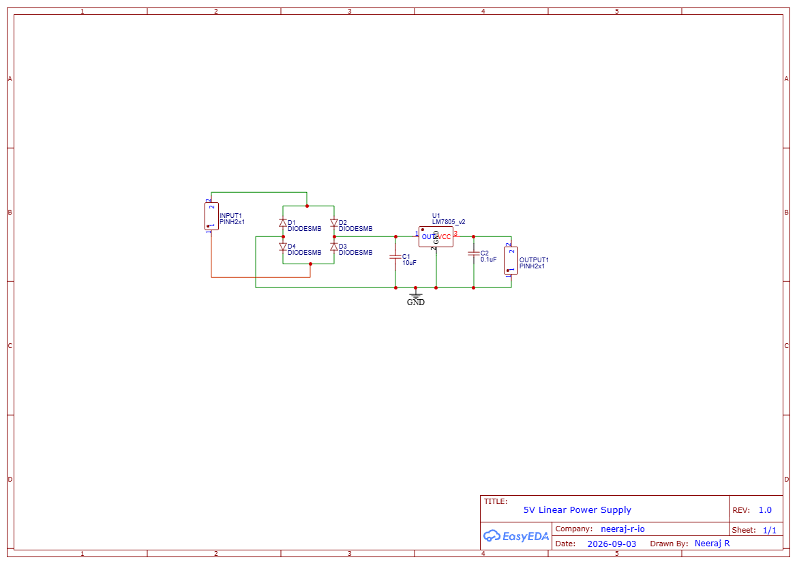

# # 5V Linear Power Supply (My First PCB)

## Description
This is my first PCB design project! It is a simple, robust 5V linear power supply designed in EasyEDA. The circuit takes an AC or unregulated DC input, passes it through a full-wave bridge rectifier, filters it, and uses an LM7805 voltage regulator to output a stable 5V DC.

## Circuit Details
Based on the schematic, the circuit consists of:
* **Input:** 2-pin header for incoming power.
* **Rectification:** Full-bridge rectifier (D1-D4) allowing for AC input or polarity-agnostic DC input.
* **Regulation:** LM7805 5V Linear Voltage Regulator.
* **Filtering:** 10µF input capacitor and 0.1µF output capacitor for noise reduction and voltage stability.

## Schematic

## Repository Contents
* `src/SCH_MY-first-PCB_2026-09-03.json` - EasyEDA project files (.zip or .json).
* `gerbers/Gerber_MY-first-PCB_PCB_MY-first-PCB_2026-09-03.zip` - Manufacturing `.zip` file ready to be sent to a PCB fabrication house.
* `BOM_MY-first-PCB_2026-09-03.csv` - Bill of Materials.

## Bill of Materials (BOM)
| Reference | Value/Part | Description |
| :--- | :--- | :--- |
| PH1 | PINH2x1 | 2-pin input header |
| D1, D2, D3, D4 | DIODESMB | Rectifier Diodes (SMB surface mount package) |
| C1 | 10uF | Input Filter Capacitor |
| U1 | LM7805_v2 | 5V Linear Voltage Regulator |
| C2 | 0.1uF | Output Filter Capacitor |

## Software Used
* [EasyEDA](https://easyeda.com/) - For schematic capture and PCB layout.
